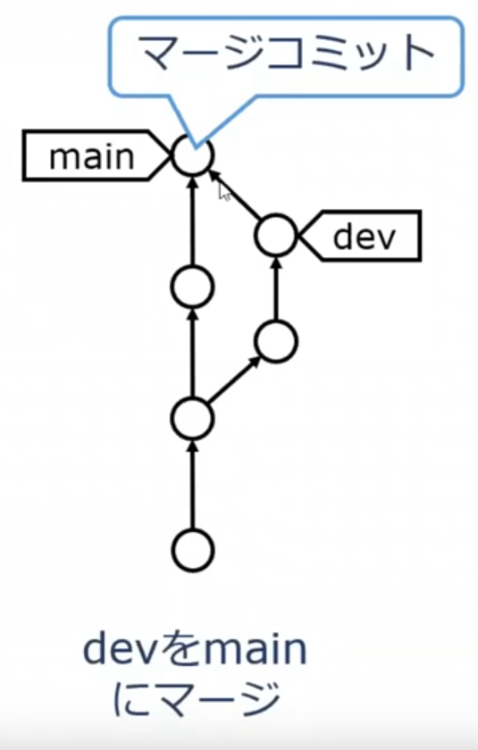

<!-- _class: lead -->


# Git 入門

<!-- footer:  名古屋工業大学プログラミング部 C0de -->

---

<!-- _class: image-one -->

<!-- _header: Gitとは(1/2) -->

# プログラムの履歴の記録


### :+1: できること

- ファイル履歴をスマートに管理
  - 右のような例をなくすことが可能
- 昔のバージョンに戻る
  - 例：「この実装だめだわ:sob: 戻ろ」
- スマートな共同開発
  - ファイルを送りあったりしなくてよい

---

<!-- _class: image-one -->

<!-- _header: Gitとは(2/2) -->


- Linux カーネルの開発をするために Linus が開発
- 個人でも企業でも使用される
  - Git を用いた開発経験とチーム開発経験は面接でよく聞かれる（もしくは当たり前と思われる）
- 右のおっさんがLinus 
  - "[NVIDIA は最低の会社。NVIDIA F\*\*K YOU!"](https://www.youtube.com/watch?v=tQIdxbWhHSM)はあまりにも有名

---

<!-- _class: lead -->


# コマンド

---

<!-- _header: 使用頻度ランキング（私見） -->

1. add, commit, status
1. push
1. stash, switch, branch
1. clone, init
1. reset
1. rm, mv
1. merge
1. revert, diff
1. checkout(上位互換が現れたためあまり使われない)

---

<!-- _header: 基本的な流れ -ローカルリポジトリで完結する場合- -->

<!-- _class: image-one -->


1. ローカルリポジトリの初期化
1. ステージング
    - コミットしたい作業ファイルの変更をインデックスに追加
1. コミット
    - ローカルリポジトリにコミット
    - イメージは「セーブポイントの作成」
1. プッシュ
    - コミットをリモートリポジトリにプッシュ

---


<!-- _header: 基本的な流れ -コラボレーターとして開発する場合-  -->

<!-- _class: image-one -->

1. `main`からブランチを切る
1. プッシュする
1. `main`に Pull Request を出す
1. レビューされる
    - 「ここを直してくれ」
    - 「ここはどういう意味？」
1. （承認されたら）マージする

`main`ブランチに直接コミット、プッシュはしない！


---

<!-- _header: 基本的な流れ -世界とつながる場合- -->

<!-- _class: image-one -->


A. 誰かのリモートリポジトリ
B. 自分のリモートリポジトリ
C. 自分のローカルリポジトリ

**重要ポイント**
自分のリモートリポジトリから相手のリモートリポジトリに Pull Request を送る

Pull Request:
 「こんな変更を加えたので Pull してください」というリクエスト


---

<!-- _header: git init -->

# リポジトリの新規作成

- `.git/`フォルダが作成される
- 注意
  - `.github/`と`.git/`は異なるもの
  - `git clone`した場合は`git init`は必要ない
    - クローンはGitHub から`.git/`をコピーするようなもの

---

<!-- _header: git add -->
<!-- _class: image-one -->


## ファイルのステージ(stage)

- 使い方の例
  - `git add .zshrc`
  - `git add *.c`
    - `main.c`や`index.c`など、拡張子が`c`のファイルをすべてステージング
  - `git add images/` 
    - `images/`下のファイルをすべてステージング

---

<!-- _header: git commit -->

<!-- _class: image-one -->


### ローカルリポジトリへファイルをコミット

- 例
  1. `git commit -m "fix: fix typo"`
  2. `git commit --verbose`(おすすめはしない)
- `git commit` だけだと変な画面()に遷移
  - ターミナルから Vi や nano といったエディタが開く
  - 初心者だとこの画面を抜けるだけで大変

---

<!-- _header: git commit (余談) -->

<!-- _class: image-one -->


#### 野上は `git commit --verbose` を使用

- コミットするものに間違いがないか確認できるから
    - ただし diff はものすごい見にくい
    - diff だけは VSCode で見る
- コミット時に Vim エディタを起動する方法
    - `git config --global core.editor vim`
    - 何も設定しないと Nano エディタが起動
- エイリアス`gc`を追加
    - `gc='git commit --verbose'`(Linux)

---
<!-- _header: git status -->

# 状況の表示

- 使い方
  - `git status`
- エイリアスを登録すると便利
    - 野上は `alias gst='git status'`
- 何かおかしくなったら`git status`を打って、メッセージを読もう
    - だいたい解決方法が書いてある

---

<!-- _header: コミットメッセージの書き方 -->

### コミットメッセージを見て内容が想像できるように書く

例

- docs: ○○ を追記
- fix: ○○ のバグを直した
- feat: ○○ を実装

他に
- [Git のコミットメッセージの書き方](https://zenn.dev/itosho/articles/git-commit-message-2023)
  （今すぐ読む必要はない。いつか思い出そう）
- [企業のものを見てみよう](https://github.com/yumemi-inc/android-engineer-codecheck/commits/main)

---

<!-- _header: 問題1 -->

### README.mdを作成してコミットしてみよう

内容
1. 自分でリポジトリを作る(init)
1. README.md に何か書く
1. ステージングする
1. コミットする

---

<!-- _header: 解答1 -->

<!-- _class: src -->

```zsh
$ git init
(README.md になにか書く)
$ git add README.md
$ git commit -m "docs: README を更新"
```
内容
1. 自分でリポジトリを作る(init)
1. README.md に何か書く
1. ステージング
1. コミット

:warning: $ の後ろに文字が実際に打つコマンド
$ マークは慣習的にターミナルを表すもの

---

<!-- _header: Logを見る (CLI) -->

# コミット履歴の閲覧

- 使い方
  - `git log`
  - `git log --graph`
    - 履歴をグラフ化してくれる
    - 現在のブランチの履歴のみ
    - 野上は VSCode の `Git Graph` が好き
  - `git log --graph --all`
    - すべてのブランチのコミット履歴をグラフとして表示

---

<!-- _header: Logを見る (GUI) -->

<!-- _class: image-one -->


方法
- VSCode 拡張機能 Git Graph
- Git の GUI
    - Sourcetree
    - GitKraken

野上は Git Graph 使ってます
これで充分


---

<!-- _header: コミットを取り消す(1) ちょっと難しい -->

# git revert とは
- 「取り消したいコミットを打ち消すようなコミットを新しく生成する」もの
    - 「歴史をなかったことにする」のではなく、「ここからやり直そう」
- 「コミットしたけど変なファイル入ってた」はよくあること
    - これを`revert`を使用して取り消す

(余談)
- マージコミットを取り消したいときの`revert`は特別
  - `git revert -m [1|2] <commit>`
---

<!-- _header: コミットを取り消す(2) 超危険 -->

<!-- _class: src -->

```sh
# HEAD を移す
# 直前のコミットはステージング領域へ
$ git reset --soft HEAD^
# 上と同義
$ git reset --soft HEAD~1
```

### git reset

- `git reset --soft <commit>`
  - HEAD を指定したコミットにリセット
- `git reset --mixed <commit>`
  - インデックスもリセット
- `git reset --hard <commmit>`
  - インデックスとワークツリーをリセット

---

<!-- _header: 問題2 -->

# 新しくコミットしてそれを打ち消す

1. 新しく何かコミットする
1. ログで確認
1. それを打ち消す
1. ログで確認

---

<!-- _header: 演習問題3 -->

<!-- _class: image-one -->


### 次のことをやってみよう

1. リモートリポジトリにプッシュ
1. ローカルにコミット
1. 再度リモートリポジトリにプッシュ


ポイント
1. `git remote -v` でローカルに紐付いているリモートリポジトリが見れる
1. `git remote add origin <githubのリポジトリのurl>`

---

<!-- _header: 解答例 3 -->

<!-- _class: src -->

```
# ⚠：すでにローカルにコミットしている状態

# リモートリポジトリの紐付きの確認
$ git remote -v

# リモートリポジトリの追加の例
$ git remote add origin https://github.com/*.git

# 現在のブランチ名が main の場合
$ git push origin main

# 現在のブランチ名が master の場合
$ git push origin master

# 何か変更を加えてそれを add, commitし、push する
# GitHub に確認できたら完了

```

### 次のことをやってみよう

1. リモートリポジトリにプッシュ
1. ローカルにコミット
1. 再度リモートリポジトリにプッシュ

---

<!-- _header: ブランチ -->

<!-- _class: image-one -->

# コミットに付いたラベル(ポインタ)


- ブランチの切り方
  - おすすめ：`git switch -c hoge`
    - `-c` は create という意味
    - ブランチを作成して移動するという意味
  - 古い書き方：`git checkout -b`
- ブランチの移動の仕方
  - おすすめ：`git switch hoge`
  - 古い書き方：`git checkout hoge`


---

<!-- _header: コンフリクト解消 -->

<!-- _class: src -->

```
<<<<<<< HEAD
(今自分がチェックアウトしているブランチでの変更)
=======
（取りこもうとしたブランチでの変更）
>>>>>>>
```

マージしようとしたものがコンフリクトしているとこのように書き込まれる

解消の方法

- この\<や\>を消しつつ内容を正しいものに
  修正する
- ステージングする
- コミットする

つまり最終的にあるべきソースコードとなるように変更して、`git add`

---

<!-- _header: 問題4 -->

<!-- _class: image-one -->


### 新しくブランチを切り、コミットし、GitHub から PR を出す（1人で）

1. `main`から適当にブランチを切る
1. プッシュする
1. `main`に Pull Request を出す
1. 良いと思ったらマージする

---


<!-- _header: .gitignore -->

# 管理したくないものをリストアップ

- 例：\*.local.env

## 注意

一度ステージングしてしまったものを後から`.gitignore`に追加しても意味がない

- `git rm --cached hoge`

---

<!-- _header: 今日紹介しないけど超便利なやつ -->

## git stash

- **「しまった。develop ブランチで作業するつもりが main ブランチで作業してた」**　という時に使用
