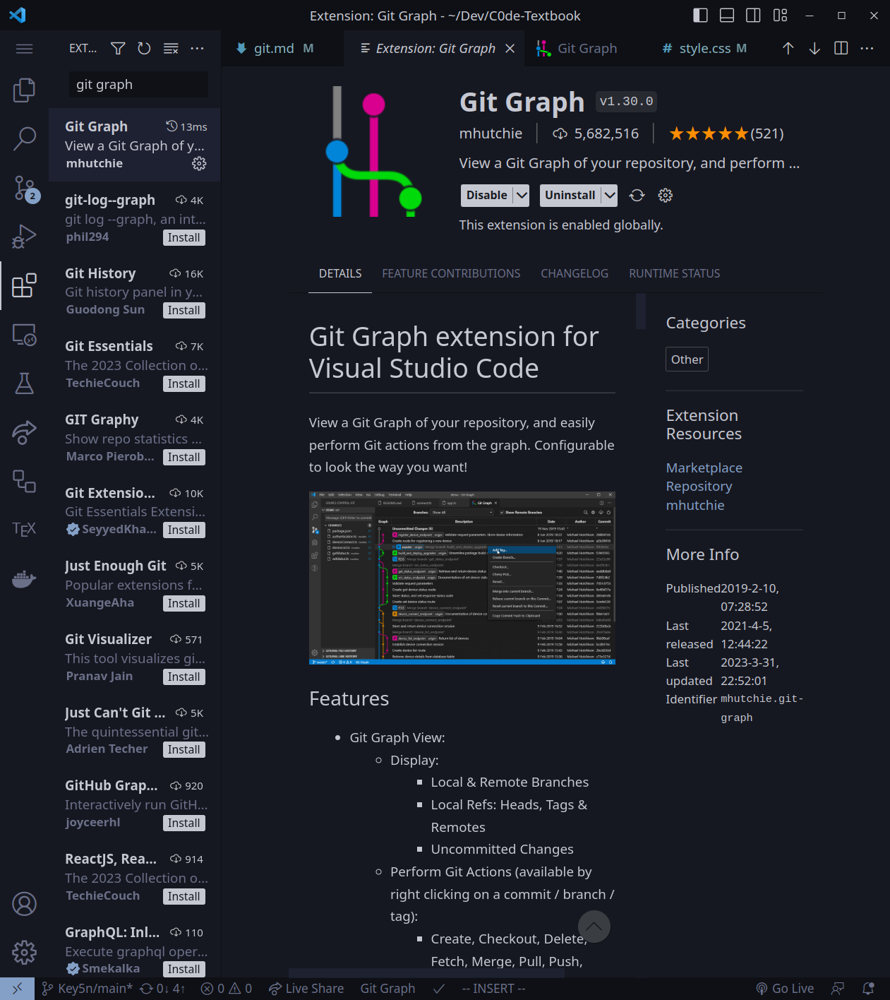

<!-- _class: lead -->


# Git 入門

<!-- footer:  名古屋工業大学プログラミング部 C0de -->

---

<!-- _class: image-one -->

<!-- _header: Gitとは -->

# プログラムの履歴の記録


### :+1: できること

- ファイル履歴をスマートに管理
  - 右のような例をなくすことが可能
- 昔のバージョンに戻る
  - 例：「この実装だめだわ:sob: 戻ろ」
- スマートな共同開発
  - ファイルを送りあったりしなくてよい

---

<!-- _class: image-one -->

<!-- _header: Gitとは -->


- フィンランド出身のプログラマ  
  - Linus が Linux カーネル開発のために作った分散型ソースコード管理システム
- Linux カーネルの開発をするために Linus が開発
  - バージョン管理システムは他にもあるが、Git が最強
- 個人でも企業でも使用される
  - Git を用いた開発経験とチーム開発経験は面接で必ず聞かれる
  （もしくはあるものと思われる）

---

<!-- _class: lead -->


# コマンド

---

<!-- _header: 使用頻度ランキング（私見） -->

1. add, commit, status
1. push
1. stash, switch
1. clone, init
1. reset
1. rm, mv
1. merge
1. revert, diff
1. branch, checkout(今の時代はあまり使われない)

---

<!-- _header: 基本的な流れ1/2 -->

<!-- _class: image-one -->


1. `git init`：ローカルリポジトリの初期化
1. `git add <ファイル名>`
    - 作業ファイルの変更をインデックスに追加
    - `git add index.html`, `git add .`
1. `git commit`
    - ローカルリポジトリにコミット
    - `git commit -m "fix: タイポを修正"`
1. `git push`
    - リモートリポジトリにプッシュ
    - `git push origin main`

---

<!-- _header: 基本的な流れ2/2 -->

<!-- _class: image-one -->


A. 


---

<!-- _header: git init -->

# リポジトリの新規作成

- `.git`フォルダが作成される
- 注意
  - `.github/`と`.git/`は異なるもの
  - `git clone`した場合は必要ない

---

<!-- _header: git add -->
<!-- _class: image-one -->


# ファイルのステージ(stage)

- 使い方
  - `git add .zshrc`
  - `git add *.c`
      - zsh の場合 `git add \*.c`
  - `git add images/` 
  (ディレクトリのファイルをまとめて)ステージング

---

<!-- _header: git commit -->

<!-- _class: image-one -->


# ローカルリポジトリへのファイルのコミット

- 使い方
  - `git commit -m "fix: fixed typo"`
  - `git commit --verbose`(おすすめはしない)
- `git commit` だけだと変な画面:smile:に遷移

---

<!-- _header: git commit (余談) -->

<!-- _class: image-one -->


#### 野上は `git commit --verbose` を使用

- コミットするものに間違いがないか確認できるから
    - ただし diff はものすごい見にくい
    - diff だけは VSCode で見る
- コミット時に Vim エディタを起動する方法
    - `git config --global core.editor vim`
    - 何も設定しないと Nano エディタが起動
- エイリアス`gc`を追加
    - `gc='git commit --verbose'`(Linux)

---
<!-- _header: git status -->

# 状況の表示

- 使い方
  - `git status`
- エイリアスを登録しておこう
    - 野上は `alias gst='git status'`
- 何かおかしくなったら`git status`を打って、メッセージを読もう
    - 代替解決方法が書いてある

---

<!-- _header: コミットメッセージの書き方 -->

### コミットメッセージを見て内容が想像できるように書く

例

- docs: ○○ を追記
- fix: ○○ のバグを直した
- feat: ○○ を実装

他に
- [Git のコミットメッセージの書き方](https://zenn.dev/itosho/articles/git-commit-message-2023)
  （今すぐ読む必要はない。いつか思い出そう）
- [企業のものを見てみよう](https://github.com/yumemi-inc/android-engineer-codecheck/commits/main)

---

<!-- _header: Markdown ファイルをコミットしてみる -->

# ローカルリポジトリにコミット

1. 自分でリポジトリを作る(init)
1. README.md に何か書く
1. ステージングする
1. コミットする

---

<!-- _header: 問題1 -->

<!-- _class: src -->

```zsh
$ git init
(README.md になにか書く)
$ git add README.md
$ git commit -m "docs: README を更新"
```

# ローカルにコミット

1. 自分でリポジトリを作る(init)
1. README.md に何か書く
1. ステージング
1. コミット

:warning: $ の後ろに文字が実際に打つコマンド
$ マークは慣習的にターミナルを表すもの

---

<!-- _header: Logを見る (CLI) -->

# コミット履歴の閲覧

- 使い方
  - `git log`
  - `git log --graph`
    - 履歴をグラフ化してくれる
    - 現在のブランチの履歴のみ
    - 野上は VSCode の `Git Graph` が好き
  - `git log --graph --all`
    - すべてのブランチのコミット履歴をグラフとして表示

---

<!-- _header: Logを見る (GUI) -->

<!-- _class: image-one -->



方法
- VSCode 拡張機能 Git Graph
- Git の GUI
    - Sourcetree
    - GitKraken

野上は Git Graph 使ってます
これで充分


---

<!-- _header: コミットを取り消す(1) ちょっと難しい -->

# git revert とは
- 「取り消したいコミットを打ち消すようなコミットを新しく生成する」もの
    - 「歴史をなかったことにする」のではなく、「ここからやり直そう」
- 「コミットしたけど変なファイル入ってた」はよくあること
    - これを`revert`を使用して取り消す

(余談)
- マージコミットを取り消したいときの`revert`は特別
  - `git revert -m [1|2] <commit>`
---

<!-- _header: コミットを取り消す(2) 超危険 -->

<!-- _class: src -->

```sh
# HEAD を移す
# 直前のコミットはステージング領域へ
$ git reset --soft HEAD^
# 上と同義
$ git reset --soft HEAD~1
```

### git reset

- `git reset --soft <commit>`
  - HEAD を指定したコミットにリセット

- `git reset --mixed <commit>`
  - インデックスもリセット

- `git reset --hard <commmit>`
  - インデックスとワークツリーをリセット

---

<!-- _header: 問題2 -->

# 新しくコミットしてそれを打ち消す

1. 新しく何かコミットする
1. ログで確認
1. それを打ち消す
1. ログで確認

---

<!-- _header: 演習問題3 -->

# リモートリポジトリへの追加

1.Github 上でリポジトリの作成

1. git remote -v で現在のリモートリポジトリの確認
1. git remote add origin \<url\>
1. git remote -v でリモートリポジトリが追加されていることの確認
1. git push origin \<今のブランチ名\>
1. Github 上でいろいろ見てみよう
   - コミット履歴
   - コミットメッセージ

---

<!-- _header: ブランチ -->

<!-- _class: image-one -->

# コミットに付いたラベル(ポインタ)


- ブランチの切り方

  - `git switch -c hoge`
    - おすすめ
  - `git checkout -b`
    - 古い書き方

- ブランチの移動の仕方
  - `git switch hoge`
  - `git checkout hoge`


---

<!-- _header: コンフリクト解消 -->

<!-- _class: src -->

```
<<<<<<< HEAD
(今自分がチェックアウトしているブランチでの変更)
=======
（取りこもうとしたブランチでの変更）
>>>>>>>
```

マージしようとしたものがコンフリクトしているとこのように書き込まれる

解消の方法

- この\<や\>を消しつつ内容を正しいものに
  修正する
- ステージングする
- コミットする

つまり最終的にあるべきソースコードとなるように変更して、`git add`

---

<!-- _header: 問題4 -->

<!-- _class: image-one -->


# フォークしてクローンして PR を出そう

1. Github 上でフォークする
1. git clone \<url\>
1. 何かしらのブランチを切る
1. 変更を加える
1. 自分のリポジトリにプッシュする
1. PR を出す

---

<!-- _header: 問題5 -->

# コンフリクトしてみよう

1. ローカルリポジトリとリモートリポジトリの内容を同期
1. ローカルの内容をいじる
1. その内容でコミットする
1. git pull でリモートから引っ張ってくる
1. コンフリクトするはず

---

<!-- _header: .gitignore -->

# 管理したくないものをリストアップ

- 例：\*.local.env
  - API キーの墓場

## 注意

一度ステージングしてしまったものを後から`.gitignore`に追加しても意味がない

- git rm --cached hoge

---

<!-- _header: 今日紹介しないけどこんなものもあるよ -->

## git diff

- コミット前にどんな変更があるか確認したい解き
  - とても見にくいから VSCode の機能がおすすめ

## git stash

- **「しまった。develop ブランチで作業するつもりが main ブランチで作業してた」**という時に使用
